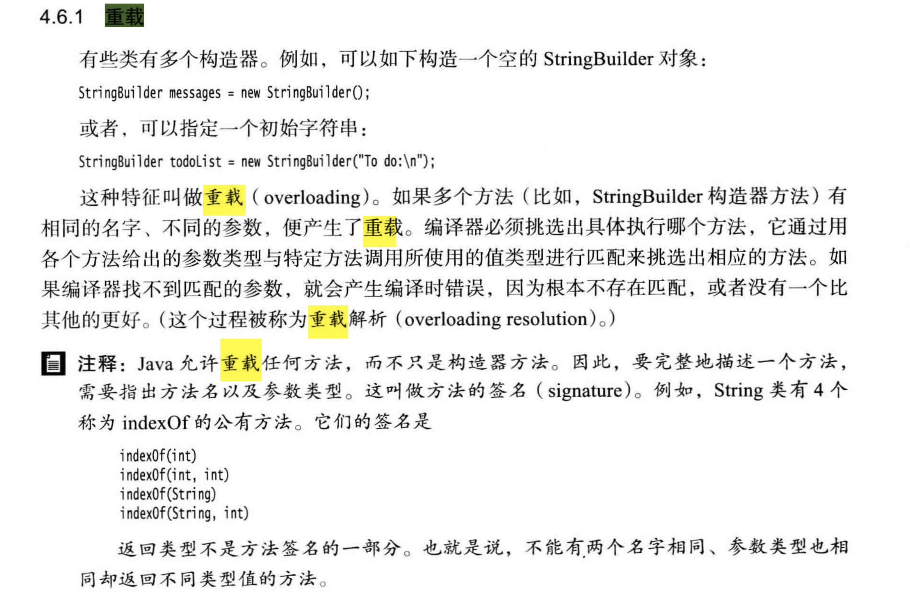

# JAVA基础

## 基础知识

1. Java 语⾔有哪些特点?

	- 简单易学
	- 面向对象（封装、继承、多态）
	- 跨平台
	- 可靠性
	- 安全性
	- 支持多线程（C++语言没有内置的多线程机制，因此必须调用操作系统的多线程功能来进行多线程设计，Java提供了多线程支持）
	- 支持网络编程
	- 编译与解释并存

2. JVM、JDK 和 JRE 联系与区别？

	JVM（Java虚拟机）是运行Java字节码的虚拟机，JVM针对于不同的操作系统有不同的实现（Windows,Linux,Mac os），在不同的操作系统上使用相同的字节码文件可以得到相同的结果。
	
	Java程序从源代码到运行一般经历下面3个步骤：
	
	
	
	JDK（Java Development Kit）是功能齐全的Java SDK，它不止有JRE，还有编译器（Javac）和工具（例如Java doc 和Jdb），它可以创建和编译程序。
	
	JRE是Java运行时环境，它是运行已经编译的Java程序所需的内容的集合，包括Java虚拟机、Java类库、Java命令和其他的一些基础构件，但是，它不能用来创建新的程序。
	
3. Java 和 C++的区别?

	- 都是面向对象的语言，都具有继承、封装、多态的特性
	- Java不提供指针来直接访问内存，程序内存更加安全
	- Java的类是单继承的，但接口可以多继承，C++支持多重继承
	- Java有自动内存管理机制，C++需要手动释放无用的内存

4. 构造器 Constructor 是否可被 override?

	构造器无法被重写，但可以重载。

5. 重载和重写的区别

	重载发生在同一个类中，方法名必须相同，参数类型、个数、顺序不同，方法返回值和修饰值可以不同。下面是《Java核心技术》对于重载的介绍：

	

6. Java ⾯向对象编程三⼤特性: 封装 继承 多态

	- 封装

	封装是把一个对象的属性私有化，根据需要提供一些可以被外界访问属性的方法。

	- 继承

	继承是使用已经存在的类的定义作为基础建立新的类，新类的定义可以增加新的数据或功能，也可以使用父类的功能，子类拥有父类所有的属性和方法（包括私有属性和私有方法），但是父类中的私有属性和方法子类是无法访问的，子类可以拥有自己的属性和方法，即子类可以对父类进行扩展，子类也可以重写父类的方法。

	- 多态

	多态是值程序中定义的引用变量所指向的具体类型和通过该引用变量发出的方法调用在编程时并不确定，而是在程序运行期间才确定，即一个引用变量到底会指向哪个类的实例对象，该引用变量发出的方法调用到底是哪个类中实现的方法，必须是在程序运行期间才能决定。

7. String StringBuffer 和 StringBuilder 的区别是什么? String 为什么是不可变的?

	- String：不可变字符序列
	- StringBuffer：可变字符序列，效率低，线程安全
	- StringBuilder：可变字符序列，效率高，线程不安全

8. 深拷贝和浅拷贝的区别？

	浅拷贝：对于基本数据类型进行值传递，对引用数据类型进行引用传递般的拷贝；

	深拷贝：对基本数据类型进行值传递，对引用数据类型，创建一个新的对象，并复制其内容，此为深拷贝。

9. 接口和抽象类的区别

	- 接口的方法默认都是public，所有的方法在接口中不能有实现；

	- 接口中除了static、final变量，不能有其他变量，而抽象类中则不一定；

	- 一个类可以实现多个接口，但只能实现一个抽象类。但接口本身可以多继承。

	- 接口方法的默认修饰符是public，抽象类的方法的修复可以是public、protected和default这些修饰符（不能是private）；

	- 从设计的层面来说，抽象是对类的抽象，是一种模板设计，而接口是对行为的抽象，是一种行为的规范。

		以上对JDK8之前的定义和规范，从JDK8开始接口的概念有了一些变化：

	在JDK7或更早的版本中，接口里面只能由常量、变量和抽象方法，实现接口类必须重写接口中的抽象方法，JDK8接口中增加了默认方法和静态方法，JDK9接口中增加了私有方法和私有静态方法。

10. 构造方法有哪些特性？

	- 名称与类名相同

	- 没有返回值，但不能用void声明构造方法

	- 生成类的对象时自动执行，无需调用

	- 默认有一个不带参数的构造方法

	- 如果显式的指定了带参的构造方法，默认不再提供无参的构造方法

		

11. ⾃动装箱与拆箱

	装箱就是自动将基本数据类型转换为包装器类型；拆箱就是自动将包装器类型转换为基本数据类型。

	在JDK5之前：

	```java
	Integer i = new Integer(10);
	```

	JDK5之后：

	```java
	Integer i = 10;
	```

	基本数据类型对应的包装类型：

	| 基本类型        | 包装类型  |
	| --------------- | --------- |
	| int(4字节)      | Integer   |
	| byte(1字节)     | Byte      |
	| short(2字节)    | Short     |
	| long(8字节)     | Long      |
	| float（4字节）  | Float     |
	| double（8字节） | Double    |
	| char（2字节）   | Character |
	| boolean         | Boolean   |

	

## 集合

1. List、Set、Map三者的区别？

	List用来存储一组不唯一（可以重复），有序的对象；

	Set用来存储不允许重复的集合，不会有多个元素引用相同集合的对象；

	Map是用来存储键值对的，Map会维护与Key有关联的值，两个不同的Key可以引用相同的对象，Key不能重复。

## 常用框架

1. 什么是Spring框架？

	Spring是一个轻量级的IOC/AOP容器框架，旨在提高开发人员的开发效率以及系统的可维护性。我们一般说的Spring框架其实指的是Spring Framework，它是很多模块的集合，包括了核心容器、数据访问/继承，Web，Aop，工具，消息和测试模块。Core Containier中的Core组件时Spring所有组件的核心，Beans组件和Context组件是实现IOC和依赖注入的基础，Aop组件用来实现面向切面编程。Spring的6个特征：

	- 核心技术：依赖注入（DI），AOP，事件（events），资源，i18n，验证，数据绑定，类型转换，SpEl
	- 测试：模拟对象，TestContext框架，Spring Mvc测试，WebTestClient
	- 数据访问：事务，DAO支持，JDBC，ORM，编组XML
	- WEB支持：Spring Mvc和Spring WebFlux Web框架
	- 集成：远程处理，JMS，JCA，JMX，电子邮件，任务，调度，缓存
	- 语言：kotlin，Groovy，动态语言

## 数据库

1. 什么是MySQL？

	​	MySQL是一种关系型数据库，由瑞典 MySQL AB 公司开发，目前属于 Oracle 公司。MySQL 是一种关联数据库管理系统，关联数据库将数据保存在不同的表中，而不是将所有数据放在一个大仓库内，这样就增加了速度并提高了灵活性，MySQL具有以下特征：

	- MySQL 是开源的，所以你不需要支付额外的费用。
	- MySQL 支持大型的数据库。可以处理拥有上千万条记录的大型数据库。
	- MySQL 使用标准的 SQL 数据语言形式。
	- MySQL 可以运行于多个系统上，并且支持多种语言。这些编程语言包括 C、C++、Python、Java、Perl、PHP、Eiffel、Ruby 和 Tcl 等。
	- MySQL 支持大型数据库，支持 5000 万条记录的数据仓库，32 位系统表文件最大可支持 4GB，64 位系统支持最大的表文件为8TB。
	- MySQL 是可以定制的，采用了 GPL 协议，你可以修改源码来开发自己的 MySQL 系统。

2. 