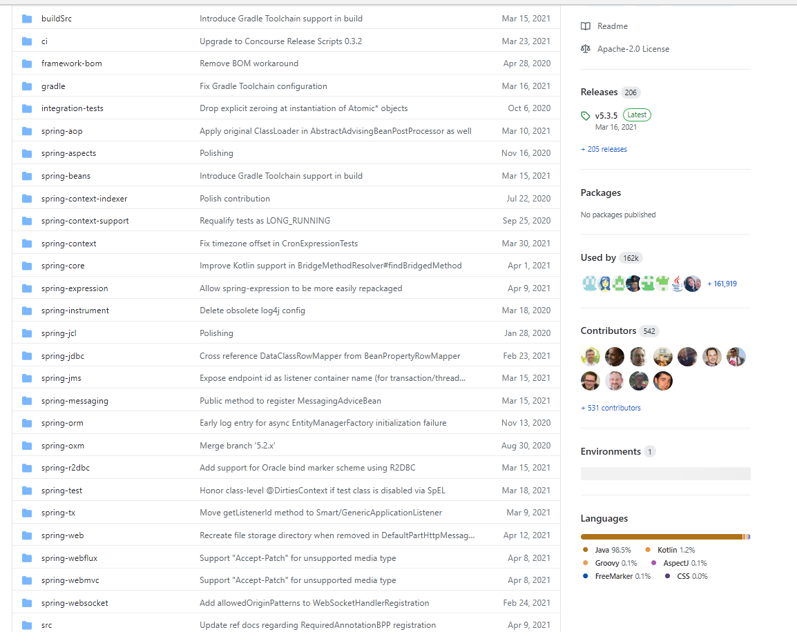

# Spring基础

## Spring特性总览

### Spring 中值得学习的地方

1. Java语言特性，例如反射、动态代理、枚举、泛型、注解、ARM、Lambda语法
2. 设计思想和模式的实现，如OOP，DDD，TDD，GoF23等
3. Java API的封装与简化，如JDBC，事务，Transaction，Servlet，JPA，JMX ，Bean Validation
4. JSR规范的适配与实现
5. 第三方框架的整合，如MyBatis整合Hibernetes和Redis

### Spring核心特性

1. IOC容器（IOC Container）
2. Spring事件（Events）
3. 资源管理（Resources）
4. 国际化（i18n）
5. 校验（Validation）
6. 数据绑定（Data Binding）
7. 类型转换（Type Conversion）
8. Spring表达式（Spring Express Language）
9. 面向切面编程（AOP）

### Spring数据存储

1. JDBC
2. 事务抽象（Transactions）
3. DAO支持（DAO Support）
4. O/R映射（O/R Mapping）
5. XML编列（XML Marshalling）

### Spring Web技术

1. Web Servlet技术栈
	1. Spring MVC
	2. WebSocket
	3. SockJS
2. Web Reactive技术栈
	1. Spring WebFlux
	2. WebClient
	3. WebSocket

### Spring技术整合

1. 远程调用（Remoting）
2. Java消息服务（JMS）
3. Java连接架构（JCA）
4. Java管理扩展（JMX）
5. Java邮件客户端（Email）
6. 本地任务（Taks）
7. 本地调度（Scheduling）
8. 缓存抽象（Caching）

### Spring测试

1. 模拟对象（Mock Objects）
2. TestContext框架（TestContext Framework）
3. Spring MVC测试（Spring MVC Test）
4. Web 测试客户端（Web TestClient）

## Spring版本特性

| Spring Framework版本 | Java标准版 | Java企业版       |
| -------------------- | ---------- | ---------------- |
| 1.x                  | 1.3+       | J2EE 1.3+        |
| 2.x                  | 1.4.2+     | J2EE 1.3+        |
| 3.x                  | 5+         | J2EE1.4和JavaEE5 |
| 4.x                  | 6+         | Java EE6和7      |
| 5.x                  | 8+         | Java EE7         |

## Spring模块化设计

[仓库链接](https://github.com/spring-projects/spring-framework)



## Spring编程模型

1. 面向对象编程

	1. 锲约接口：Aware、BeanPostProcessor...
	2. 设计模式：观察者模式、组合模式、模板模式...
	3. 对象继承：Abstract类

2. 面向切面编程

	1. 动态代理：JDKDynamicAopProxy
	2. 字节码提升：ASM、CGLib、AspectJ

3. 面向元编程

	1. 注解：模式注解（@Component、@Service、@Respository...）
	2. 配置：Environment抽象、PropertySources、BeanDefinition...
	3. 泛型：Generic TypeResolver、Resolvable Type...

4. 函数驱动

	1. 函数接口：ApplicationEventPublisher
	2. Reactive：Spring WebFlux

5. 模块驱动

	1. Maven Artifacts
	2. OSGI Bundies
	3. Java 9 Automatic Modules
	4. Spring @Enable*

	​                                                                                                                                                                                                                                                                                                                                                                                                                                                                                                                                                                                                                                                             

## Spring的核心价值

1. 生态系统
	1. Spring Boot
	2. Spring Cloud
	3. Spring Security
	4. Spring Data
	5. 其他
2. API抽象设计
	1. AOP抽象
	2. 事务抽象
	3. Environment抽象
	4. 生命周期
3. 编程模型
	1. 面向对象编程：契约接口
	2. 面向切面编程：动态代理、字节码提升
	3. 面向元编程：配置元信息、注解、配置
	4. 面向模块编程：Maven Artifacts、Java9 Automatic Modules
	5. Spring @Enable*注解
	6. 面向函数式编程：Lambda、Reactive
4. 设计思想
	1. Object-Oriented Programming（OOP）
	2. Ioc/DI
	3. Domain-Driven Development（DDD）
	4. Test-Driven Development（TDD）
	5. Event-Driven Programing（EDP）
	6. Functional Programing（FP）
5. 设计模式
	1. 专属模式
		1. 前缀模式：Enable模式
			1. Configurable模式
		2. 后缀模式
			1. 处理器模式（Process、Resolver、Handler）
			2. 意识模式（Aware）
			3. 配置器模式（Configuror）
			4. 选择器模式（ImportSelector）
	2. 传统GoF23
6. 用户基础
	1. Spring用户 Spring Framework、SpringBoot、Spring Cloud
	2. 传统用户 Java SE、Java EE

## 面试题

### 什么是Spring Framework？

 Spring Framework提供一个完整性的编程或配置的一个现代化的基于Java的企业的应用，Spring的核心特点是在应用级别上的基础设施建设。

Spring使得你的应用开发变的更容易，它可以提供任何你想要的东西，并是拥抱企业环境的Java语言，并且支持可以运行在JVM上面的其他语言，比如Groovy或者Kotlin，同时也提供一些弹性，根据软件的需要提供不同的软件架构。

### Spring Framwork有哪些核心模块？

1. Spring-core：Spring 基础API模块，如资源管理、泛型处理
2. Spring-beans：Spring Bean相关，如依赖查找，依赖注入
3. Spring-aop：Spring AOP处理，如动态代理，AOP字节码提升
4. Spring-context：事件驱动、注解驱动、模块驱动
5. Spring-expresson：Spring 表达式语言模块

### Spring Framework的优势和不足是什么？

待定...

# IoC

## IoC的发展简介

1. 1983年，好莱坞原则
2. 1988年，控制反转
3. 1996年，Inversion of control -> Hollywood principle
4. 2004年，Martin Fowler提出了自己对IoC以及DI的理解
5. 2005年，Martin Fowler对IoC做出了进一步的说明

## IoC主要实现策略

1. 使用service locator pattern（服务定位模式）
2. 通过依赖注入：
	1. 构造器注入
	2. 参数注入
	3. Setter注入
	4. 接口注入
3. 上下文的依赖查询（beancontext）
4. 模板方法设计模式（例如JDBC）
5. 策略模式

IoC主要的实现策略：依赖查找、依赖注入。

## IoC容器的职责

1. 依赖处理
	1. 依赖查找
	2. 依赖注入
2. 生命周期管理
	1. 容器
	2. 托管的资源（Java Beans或其他资源）
3. 配置
	1. 容器
	2. 外部化配置
	3. 托管的资源（Java Beans或其他资源）

## IoC的实现

1. Java SE
	- Java Beans
	- Java ServiceLoader SPI
	- JNDI（Java Naming and Directory Interface）
2. Java EE
	- EJB（Enterprise Java Beans）
	- Servlet
3. 开源
	- Apache Avalon
	- PicoContainer
	- Google Guice
	- Spring Framework

## 传统IoC容器的实现

Java Beans 作为IoC容器的特性：

- 依赖查找
- 生命周期管理
- 配置元信息
- 事件
- 自定义
- 资源管理
- 持久化

什么是Java Beans呢？

```java
/**
 * 描述人的POJO类
 */
public class Person {

    String name;

    Integer age;

    public String getName() {
        return name;
    }

    public void setName(String name) {
        this.name = name;
    }

    public Integer getAge() {
        return age;
    }

    public void setAge(Integer age) {
        this.age = age;
    }
}
```

我们可以打印这个Bean的元信息：

```java
public class BeanInfoDemo {
    public static void main(String[] args) throws Exception {
        BeanInfo beanInfo = Introspector.getBeanInfo(Person.class, Object.class);
        Stream.of(beanInfo.getPropertyDescriptors()).forEach(System.out::println);
    }
}
```

打印结果：

```txt
java.beans.PropertyDescriptor[name=age; propertyType=class java.lang.Integer; readMethod=public java.lang.Integer beans.Person.getAge(); writeMethod=public void beans.Person.setAge(java.lang.Integer)]
java.beans.PropertyDescriptor[name=name; propertyType=class java.lang.String; readMethod=public java.lang.String beans.Person.getName(); writeMethod=public void beans.Person.setName(java.lang.String)]
```

## 如何界定IoC容器是轻量级的？

以下观点出自于《J2EE Development without EJB》

1. 管理应用代码
2. 能够快速启动
3. 容器不需要一些特殊的配置来进行操作（主要是针对于EJB）
4. 容器的内存占用小以及最小化API的一个依赖
5. 容器需要一些可以管控的一个渠道，这个渠道能够帮助我们去部署和管理一些细粒度的对象，甚至是一些粗粒度的组件

## 依赖查找和依赖注入

| 类型     | 依赖处理 | 实现便利性 | 代码入侵性   | API依赖性         | 可读性 |
| -------- | -------- | ---------- | ------------ | ----------------- | ------ |
| 依赖查找 | 主动获取 | 相对繁琐   | 侵入业务逻辑 | 依赖容器API       | 良好   |
| 依赖注入 | 被动提供 | 相对便利   | 低入侵性     | 不主动依赖容器API | 一般   |

## 构造器注入和Setter注入

Spring官方推荐使用构造器注入，这样可以确保在注入时，对象不为空，但是参数过多时会影响代码的整洁性，可能需要考虑重构。

Setter注入应该主要仅用于我们的可选性的注入，因为Setter的字段本身是可以为空的。